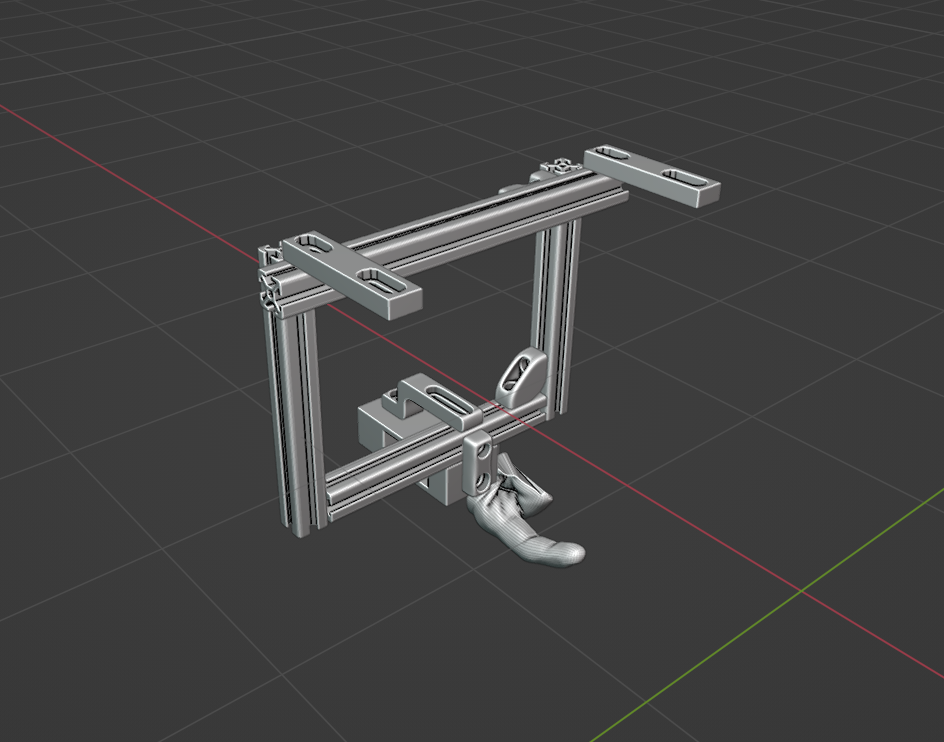
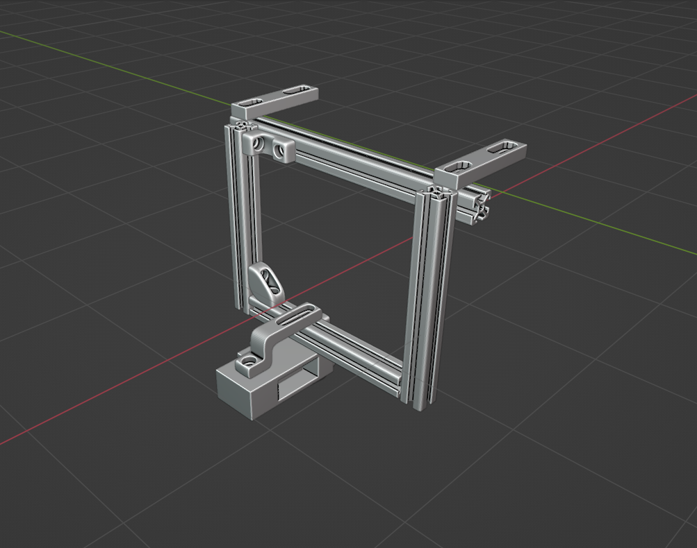
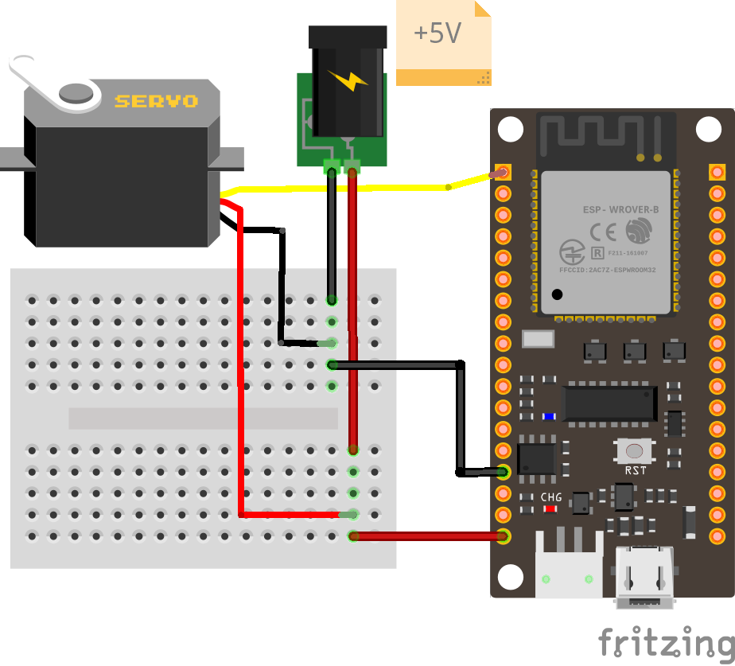
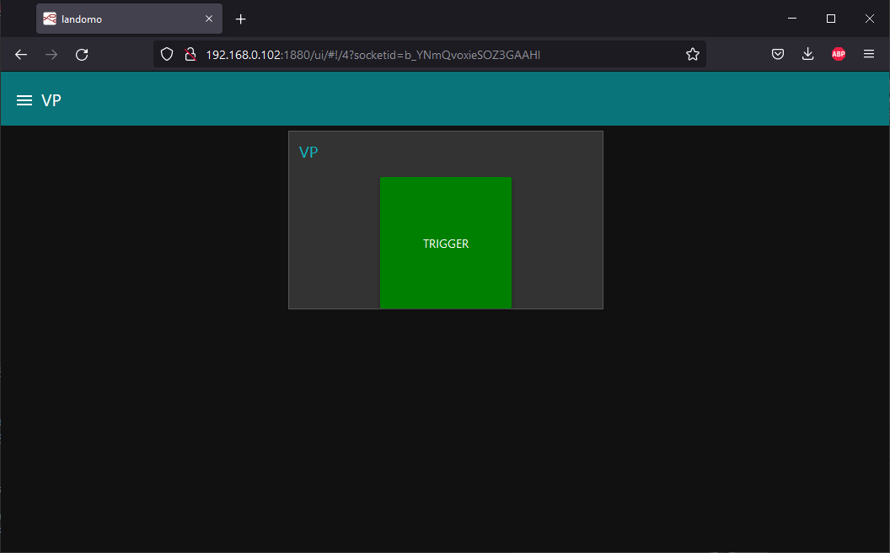

# vp remote with esp

## 3D Print parts




`_3d/_exports/`

file|quantity|
:--|:--|
case_mount_01|1|
case_mount_02|1|
finger|1|
motor_case|1|
servo_finger_transmission|1|
slider|2|
square|4|

## Elec and Wiring

- Firebeetle esp32
- Servomoteur C512





## Raspberry Pi

### PiImager - Network

**Préparation**

Télécharger `https://www.raspberrypi.com/software/`

Choisir *Raspberry Pi OS Lite (32bit)*

Paramétrer le réseau, le mot de passe du réseau et activer le ssh avant d'écrire sur la carte


**Connexion**

Pour trouver l'adresse du PI sur le réseau local : 

1. brancher un écran et un clavier. Entrer `hostname -I` dans le terminal
2. Utiliser un scane réseau comme `https://nmap.org/download`

**SSH**

Ouvrir un terminal

`ssh <Username>@<Your_RPi_IP_address>`

### NodeRed

**Installation**
```
bash <(curl -sL https://raw.githubusercontent.com/node-red/linux-installers/master/deb/update-nodejs-and-nodered)
sudo systemctl enable nodered.service
sudo reboot
```
**Dashboard**
```
node-red-stop
cd ~/.node-red
npm install node-red-dashboard
sudo reboot
```
**Check installation**

- programmation : 
  
    `http://<YOUR_RPi_IP_ADDRESS>:1880`

- visualisation : 

    `http://<Your_RPi_IP_address>:1880/ui`

**Import Flows**

Une fois connecté à l'interface NodeRed : 
- burger menu -> *Import*
- *select a file to import*
- `_scr/flows.json`

### Mosquitto

```
sudo apt update && sudo apt upgrade
sudo apt install -y mosquitto mosquitto-clients
sudo systemctl enable mosquitto.service
```

**Configuration**

`sudo nano /etc/mosquitto/mosquitto.conf`<br/>
`listener 1883`<br/>
`allow_anonymous true`
